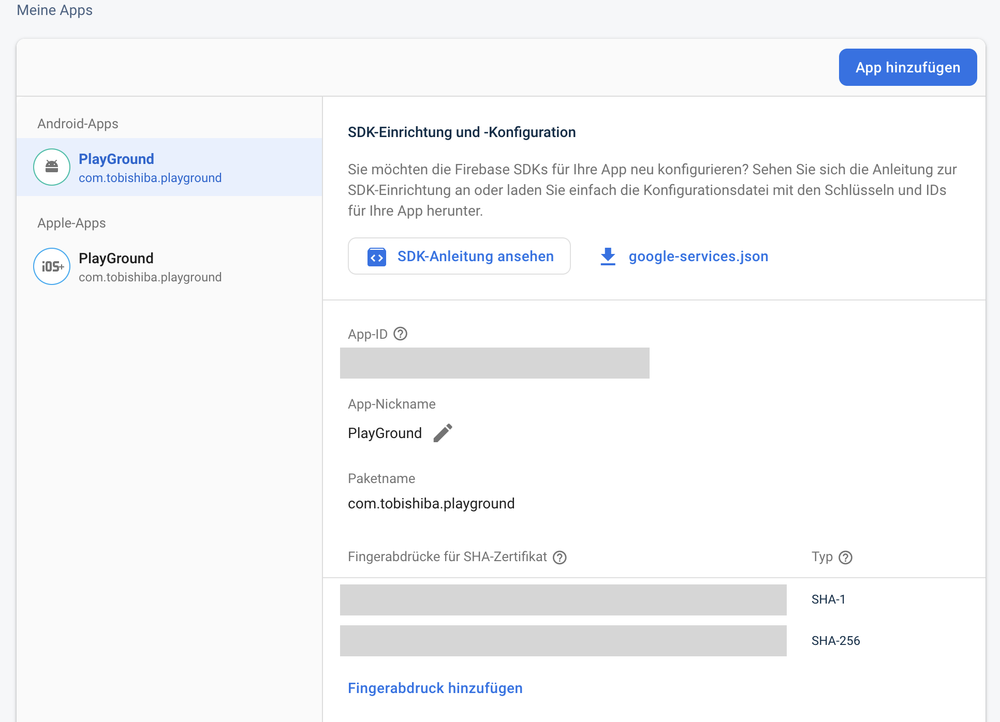

# Auth

You can use [Firebase Authentication](https://firebase.google.com/docs/auth) to allow users to sign in to your app using one or more sign-in methods, including email address and password sign-in, and federated identity providers such as Google Sign-in and Facebook Login.

## Installation
### Nuget
[](https://www.nuget.org/packages/Plugin.Firebase.Auth/)

> Install-Package Plugin.Firebase.Auth

## Setup

- Follow the instructions for the [basic setup](https://github.com/TobiasBuchholz/Plugin.Firebase/blob/master/README.md#basic-setup)
- Enable Authentication at your project in the [Firebase Console](https://console.firebase.google.com/).
- Add the following lines of code after calling `CrossFirebase.Initialize()`:
```c#
#if IOS
  FirebaseAuthImplementation.Initialize();
#elif ANDROID
  FirebaseAuthImplementation.Initialize("your-google-request-id-token");
#endif
```
- The `googleRequestIdToken` can be accessed at the [Google API Console](https://console.developers.google.com/apis/credentials) (make sure to use the Client-ID of the Web client)

### iOS specifics
- Enable keychain entitlement in Entitlements.plist:

```xml
  <dict>
    <key>keychain-access-groups</key>
    <array>
      <string>$(AppIdentifierPrefix)my.fancy.app</string>
    </array>
  </dict>
```
- In case you are using Authentication via Google, add an url scheme to your apps `Info.plist`:
```xml
  <key>CFBundleURLTypes</key>
  <array>
    <dict>
      <key>CFBundleURLSchemes</key>
      <array>
        <string>com.googleusercontent.apps.123456-abcdef</string>
      </array>
    </dict>
  </array>
```
- For more specific instructions take a look at the official [Firebase documentation](https://firebase.google.com/docs/auth/ios/start?hl=en)

### Android specifics

- Make sure you have added the SHA-1 fingerprint matching the keystore you've used for signing the app bundle to the android project settings in the firebase console: 


- Call `FirebaseAuthImplementation.HandleActivityResultAsync(requestCode, resultCode, data);` from `MainActivity.OnActivityResult(...)`
- For more specific instructions take a look at the official [Firebase documentation](https://firebase.google.com/docs/auth/android/start?hl=en)

## Usage

Take a look at the [documentation](https://github.com/xamarin/GoogleApisForiOSComponents/blob/master/docs/Firebase/Auth/GettingStarted.md) for the Xamarin.Firebase.iOS.Auth packages, because Plugin.Firebase's code is abstracted but still very similar.

Since code should be documenting itself you can also take a look at the following classes:
- [src/.../IFirebaseAuth.cs](https://github.com/TobiasBuchholz/Plugin.Firebase/blob/master/src/Shared/Auth/IFirebaseAuth.cs)
- [src/.../IFirebaseUser.cs](https://github.com/TobiasBuchholz/Plugin.Firebase/blob/master/src/Shared/Auth/IFirebaseUser.cs)
- [tests/.../AuthFixture.cs](https://github.com/TobiasBuchholz/Plugin.Firebase/blob/master/tests/Plugin.Firebase.IntegrationTests/Auth/AuthFixture.cs)
- [sample/.../AuthService.cs](https://github.com/TobiasBuchholz/Plugin.Firebase/blob/master/sample/Playground/Common/Services/Auth/AuthService.cs)
